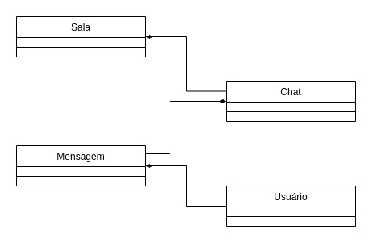

# projeto-final-lets-code
API com arquitetura RESTful. Utilizando Spring boot.

# Tema do projeto
O tema escolhido é uma aplicação de chats, em que os usuários podem conversar entre si.
\

# Funcionalidades
Várias salas de chat, nos quais os usuários podem trocar mensagens.
\
\
Mais funcionalidades em breve, estou sem ideia agora...
# Diagrama de classes

